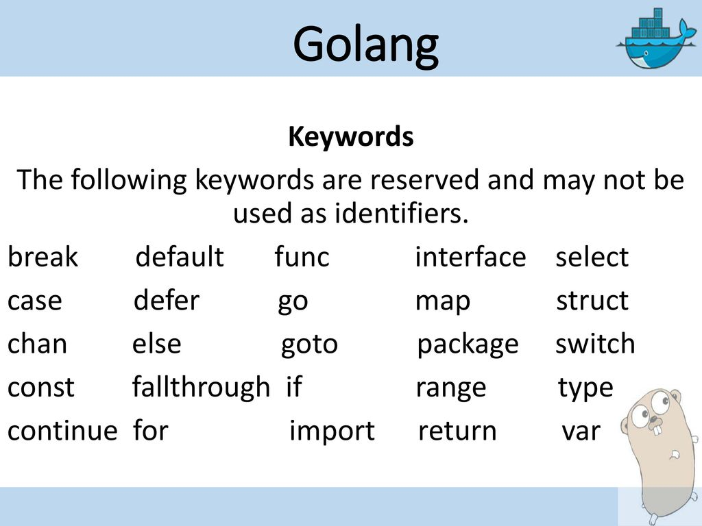

> Go is not meant to innovate programming theory. It’s meant to innovate programming practice. – Samuel Tesla

# Why Golang(后文均简称 Go) ?

当然是老板要求的，嘿嘿。笔者工作的前几年都是写 Python，刚毕业那会 Python 还没有那么火。即使到现在，Python
后端依旧不是主流。不过笔者感觉对于很多中小公司来说 Python 还是够用的，并且 Python 可以做很多事情。
最近又换工作了到了一家大厂，内部很多是 c艹 项目。对于大公司动辄有百千万甚至上亿的日活来说，很少会使用脚本语言来做高性能后端。
目前笔者开始学习使用 c++(历史遗留) 和 Golang 写后端业务，不过 c++ 写业务来说比较痛苦，很多业务开始使用 Golang 进行重构。
不得不承认，从国内招聘信息和市场行情来说，这几年 Golang 作为互联网后端语言确实越来越火，很多互联网公司都开始使用它。

说说个人感觉 Golang 的一些优缺点吧(号称 21 世纪的 C 语言):

- 有个好爹(google)和一堆牛人开发维护
- 性能高，并发友好，goroutine 支持
- 工程友好，语法简洁，容易学习、上手和维护。Go 的语法特性相比其他语言来说更加简洁，只有25个关键词
- 静态编译型语言，部署非常方便，只需要 build 一个二进制文件扔到服务器上
- 国内互联网公司 golang 岗位日益增多，高性能后端、云服务领域一门比较有前景的语言

也有一些一直被人喷的地方(当然设计哲学不同人有不同看法）：

- 错误检查，error check 比较原始。经常看到一堆 err check 代码夹杂在代码逻辑里
- 暂时没有泛型，某些场景下比较繁琐
- 生态不够完善等。Go 还是比较年轻的语言，生态相比一些发展较久的语言还想对欠缺

总得来说，笔者感觉作为微服务后端语言来说，还是完全够用的。



# 下载和安装 Golang

本系列不是针对编程新手的教程，如果你还无法访问相关网站，请自行解决。
笔者还是依旧强烈建议你使用 Linux 操作系统来学习，因为互联网公司大多使用 linxu server。
请到 golang 官网下载并且安装你的对应系统环境的安装包(go是跨平台的MacOS/Windows/Linux)

- [ https://golang.org/ ](https://golang.org/)
- [https://github.com/golang/go ](https://github.com/golang/go)

当然如果你是使用 linux/macos 还可以用对应包管理器来安装。比如笔者使用 macos 的 `brew install` 就可以安装了。
安装完成之后输入 `go version` 输出了 go 版本就安装完成，建议安装最新的版本就好，对于目前学习 go 来说版本影响不大。

# 配置环境变量

go 需要配置环境变量指定其安装路径(GOROOT)和(GOPATH)，笔者在类 unix 系统下一般只需要配置一下 GOPATH 指定你的项目路径。
比如加入如下配置到你的 `.bashrc` 或者 `.zshrc` 里边。
这里比如我在我的用户根目录建立一个名字为 go 的文件夹存放我的 go 代码。

```sh
export GOPATH=$HOME/go        # don't forget to change your path correctly!
export PATH=$PATH:$GOPATH/bin
```

之后重启终端或者 source 一下你改的 rc 文件就可以了。 到这里如果安装完成并且配置好了环境变量就可以开始编写代码了。

# 开发工具

笔者视频中将使用 neovim(vim-go插件)/tmux 等工具来进行开发演示，主要是因为笔者比较熟悉，而不一定是最好用的。
笔者建议你挑选一个自己熟悉的开发工具来编写 Golang 代码。目前社区中比较流行的有：

- Goland: 流行的 Golang IDE, Jetbrains 全家桶系列产品
- Vscode: 巨硬出品的代码编辑器，目前社区中广泛使用
- Neovim/vim: 很多 linux/mac 用户的选择，结合 vim-go 等插件开发
- Emacs/Sublime/Atom 等跨平台编辑器，结合对应的 go 语言插件

# 善用工具

一个好的编码习惯是打开你的开发工具的 gofmt(格式化代码) 和 goimports(自动 import)，这样写 go
代码会方便很多，比如保存代码的时候编辑器自动帮助你格式化代码并且引入依赖的包，大大减轻了编写代码的心智负担。
最好也加上静态检查，比如 golang 有 [golangci-lint](https://github.com/golangci/golangci-lint) 工具可以集成到你的编辑器里，(笔者用的 vim neomake)，
这样编写代码如果有一些小错误开发工具会提示你修正，减少一些在低级代码错误上浪费的时间。

# 你的第一个 Go 程序

首先记得安装 when-changed 或者类似工具，这样写完代码直接保存就可以自动运行你的 golang 代码了，解放双手的好工具。
笔者会使用 tmux 打开两个窗口，一个窗口编写代码，一个用来运行 go 并且保存代码之后自动运行输出结果。

在你的 GOPATH 下创建一个文件夹用来编写测试代码。 比如笔者的是 GOPATH 是 `$HOME/go`，然后进入到 src 里边，
随便创建一个文件夹比如叫做 expamples，然后编写一个 main.go 就可以了

好了，让我们来编写和运行第一个 Go 代码吧，打开你的开发工具然后输入以下代码：

```go
// hello_go.go
package main

import "fmt"

func main() {
	fmt.Println("Hello Golang!")
}
```

麻雀虽小五脏俱全，简单看下这段代码都用到了哪些语法特性：

- 包的声明 (package main)
- 注释, go 和 c++ 一样使用双斜线和 `/* 注释 */` 分别来注释单行和多行代码
- 每个 go 程序都以 main 函数作为入口。定义函数使用 func 开头
- 啊哈，注意在 go 代码里，必须把方括号放在函数右边，而且使用 tab 来进行代码缩进。否则编译报错，笔者这里建议大家用 gofmt
	工具自动格式化代码。go 工程上限制比较严格，直接定死了一些语法争论（比如方括号开口放哪里？用 tab 还是空格）
- 每一行代码不用最后加上分号（实际上编译器会给你做这种事）
- 调用了内置包 fmt 的函数 Println 来打印输出

你可以 git clone 这个项目到你的 `GOPATH/src` 下，然后进入 expamples 里的文件夹，找到 go 文件就可以使用 go run
运行示例代码。 视频里我会演示编写一个简单的 go 代码并且运行它。

## 练习

- 请安装 golang 开发环境和开发工具，你可以选择一个自己擅长的开发工具编写 go 代码
- 请编写你的第一个 golang 代码练习输出 hello Go！
- 搜索如何用你的开发工具借助 gofmt 来格式化你的代码，这样写代码的时候会减少心智负担，把精力集中在代码逻辑本身

下一章我们来看一下 go 语言的数据类型。
